# Hello there! I´m Davo 

## 👀 About Me

#### 🚀  Data Scientist consultant & instructor at GrowUP Data Analytics
#### 🧑‍🏫  Educational content creator, passionate about sharing knowledge
#### 🤝  Open to collaborating on innovative projects & exciting challenges
#### 🧬  Always seeking to optimize ML algorithms & push the boundaries of AI
#### 🎧  Musician, check out my work on Spotify above!
#### 🧋  Specialty coffee enthusiast & barista at heart
#### 🏃‍♂️  High-performance athlete as a triple jumper, driven by discipline

## 🛠 Skills

  
  
  
  
  
  
  
  
  
  

  

## 🚀 Other Repositories

## 📈 Stats

## ⚡ Fun fact

I started programming focused on data security at the age of 12, when I participated in math and language tournaments. 🤓

👩🏻‍💻 + 🎮 + ❤️ + 🧠 = 🎨👌🏼

### **May the code be with you** ✨

## 🔗 Contact me

---- 